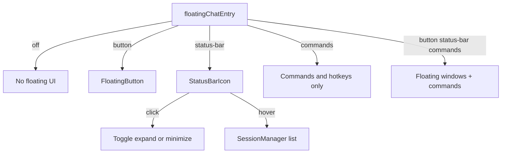

# Floating chat entry selector + status-bar Session Manager

## Also in this branch: tab-bar + on the left

In tabbed floating chat ([`src/ui/FloatingChatView.tsx`](src/ui/FloatingChatView.tsx) tab bar ~1270–1345), reorder so **Open new tab (`+`)** sits **before** `.agent-client-floating-tab-list`, not between the list and `.agent-client-floating-tab-bar-actions`.

Target order: `[+] [tabs…] … [more] [minimize] [close]`.

Adjust CSS in [`styles.css`](styles.css) if margins assumed the old right-adjacent placement. Mention briefly in CHANGELOG if user-visible.

## Behavior (locked)

One setting controls whether floating chat exists and how you open it:

| Value        | Floating windows + commands | FAB | Status bar |
| ------------ | --------------------------- | --- | ---------- |
| `off`        | No                          | No  | No         |
| `button`     | Yes                         | Yes | No         |
| `status-bar` | Yes                         | No  | Yes        |
| `commands`   | Yes                         | No  | No         |

- **Click** status-bar icon: toggle floating chat (open/expand ↔ minimize), same as one-key toggle.
- **Hover** status-bar icon: popover with the live Session Manager list (focus / rename / close).

## Settings model

In `[src/plugin.ts](src/plugin.ts)`:

- Add type + field:
  - `floatingChatEntry: "off" | "button" | "status-bar" | "commands"`
  - Default: `"off"` (same as today’s `enableFloatingChat: false`)
- **Migration** in `loadSettings`:
  - If `raw.floatingChatEntry` is a valid enum → use it
  - Else if legacy `enableFloatingChat` / `showFloatingButton` is truthy → `"button"`
  - Else → `"off"`
- Keep a derived helper (or inline checks) used everywhere today that gates on `enableFloatingChat`:
  - `isFloatingChatEnabled() => entry !== "off"`
- Prefer **replacing** the boolean in settings with the selector (stop writing `enableFloatingChat` on save after migration). If other code/docs still mention the boolean, update call sites to the helper/entry check. Do not leave two competing sources of truth.

In `[src/ui/SettingsTab.ts](src/ui/SettingsTab.ts)` under Floating chat:

- Replace **Enable floating chat** toggle with a dropdown **Floating chat**:
  - Off / Floating button / Status bar / Commands only
- On change to a non-`off` value from `off`: `openNewFloatingChat()` (collapsed), same as today’s enable path
- On change to `off`: close all floating instances
- Disable tabs / one-key / button-image when `entry === "off"`
- Disable **Floating button image** unless `entry === "button"`
- Sync status-bar mount visibility when switching to/from `status-bar`

## Floating button gate

In `[src/ui/FloatingButton.tsx](src/ui/FloatingButton.tsx)`:

- Render only when `floatingChatEntry === "button"`.

## Status bar item

New module e.g. `[src/ui/FloatingChatStatusBar.tsx](src/ui/FloatingChatStatusBar.tsx)`:

- Owned by plugin like `floatingButton`; create via `this.addStatusBarItem()` in `onload`.
- Visible only when `floatingChatEntry === "status-bar"` (subscribe to settings).
- Icon: `bot-message-square`; tooltip “Agent floating chat”.
- **Click**: `plugin.toggleFloatingChat()` — extract from `open-floating-chat-view` command (~359–390) and share with the command.
- **Hover**: ~150–200ms delay → popover above status bar; dismiss on leave (grace), Esc, outside click, or after focusing a session.

## Session Manager popover (reuse)

In `[src/ui/SessionManagerView.tsx](src/ui/SessionManagerView.tsx)`:

- Export `SessionManagerComponent` (or shared list) for the popover.
- CSS in `[styles.css](styles.css)`: `agent-client-status-bar-session-popover` (max-height, scroll, z-index). Row click → `view.focus()` then close popover.

## Docs / version

- Bump **0.13.4** (`manifest.json`, `package.json`); `[CHANGELOG.md](CHANGELOG.md)` bullet for the entry selector + status-bar hover Session Manager.
- Update `[docs/usage/floating-chat.md](docs/usage/floating-chat.md)` for the four modes.

## Verify (deploy bar)

1. `npm test` (relevant) + `npm run build`
2. Copy `main.js` / `manifest.json` / `styles.css` → vault plugin folder
3. Reload (restart if manifest alone is insufficient)
4. Check all four modes: Off; Button shows FAB only; Status bar icon toggles + hover list; Commands only has neither chrome
5. Confirm legacy `enableFloatingChat: true` vaults migrate to `button`
6. Turn **debugMode** off before finish; ask user to close/reopen chats if UI looks stale

## Out of scope

- Dual placement (FAB + status bar at once)
- Replacing the left-sidebar Session Manager leaf
- Session History modal in the status bar
- Ribbon “Open agent client” behavior

