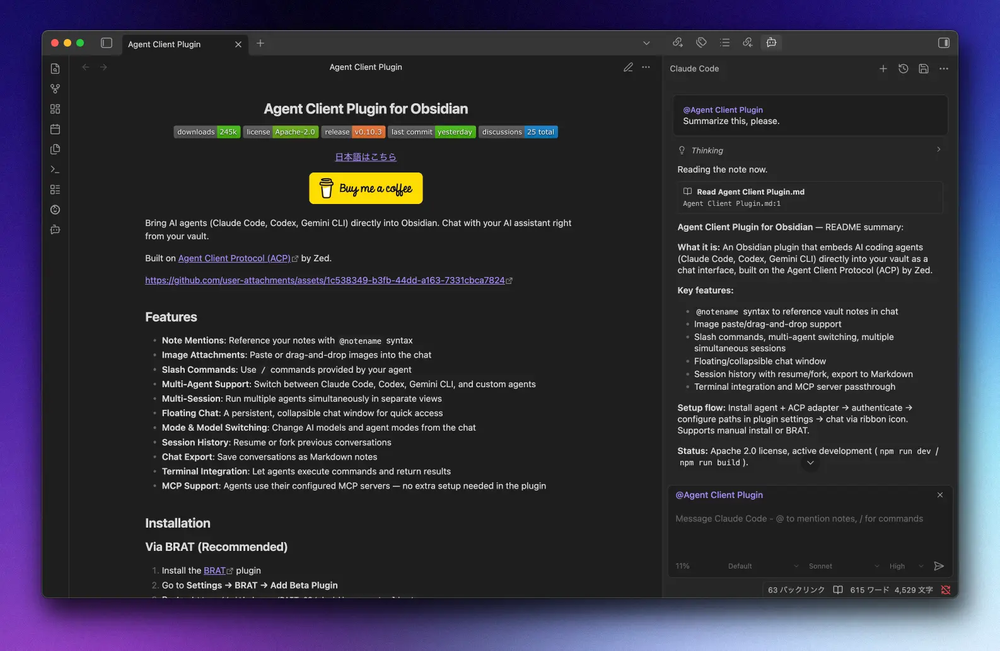
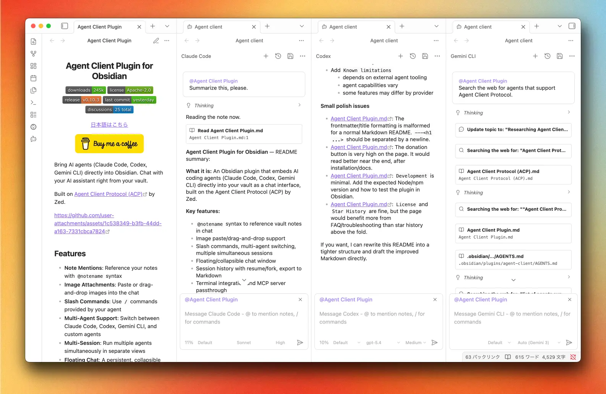

<h1 align="center">Agent Client Plugin for Obsidian</h1>

<p align="center">
  
  
  
  
  <a href="https://github.com/adrianghnguyen/obsidian-agent-client/discussions"></a>
</p>

<p align="center">
  <a href="README.md">English is here</a>
</p>

<p align="center">
  <a href="https://community.obsidian.md/plugins/agent-client" target="_blank"></a>
</p>

Claude Code、Codex、Cursor、Antigravity、および任意の ACP エージェントと、Obsidian の中でそのままチャット。`@` でノートをメンションすれば、エージェントが Vault のノートを直接読み書きします。コピペは不要です。

MCP サーバー、Agent Skills、スラッシュコマンド、権限プロンプト — エージェントができることは、追加設定なしでそのまま動きます。

Zed の [Agent Client Protocol (ACP)](https://github.com/agentclientprotocol/agent-client-protocol) の上に構築されています。



## Vault をエージェントのフロントエンドに

**並べて使う。** 複数のエージェントを同時に実行できます — サイドバータブ、エディタタブ、フローティングウィンドウで、それぞれが独立したセッションとモデルを持ちます。全ビューへのプロンプト一斉送信や、ホットキーでのフォーカス巡回も。



**どのフォルダでも。** 「New chat in directory」でチャットを任意のディレクトリに向けられます — コードプロジェクトでも、執筆プロジェクトでも、エージェントが普段働いている場所ならどこでも。エージェントはそのフォルダの context file やプロジェクト設定を読み込み、Vault のノートは `@` メンションで渡せます。

**ノートの中に。** コードブロックでノートに直接チャットを埋め込めます — エージェントを固定したり、`persist` で会話を再起動後も引き継いだり。用意したプロンプトをワンクリックで送るエージェントボタンも置けます。

**管制室。** Session Manager が、サイドバー・タブ・フローティング・ノート内に開いている全会話をステータスアイコン付きで一覧します（権限待ちも見えます）。クリックでその場へジャンプ。

**どの ACP エージェントでも。** 組み込みプリセットは Claude Code、Codex、Cursor、Antigravity。Gemini CLI や OpenCode などは [カスタムエージェント](docs/agent-setup/custom-agents.md) として追加できます。明日新しいエージェントが ACP 対応しても、カスタム登録するだけ — プラグインの更新を待つ必要はありません。

## 機能

- **ノートメンション**: `@` でノートを参照 — 名前・パス・エイリアスをファジー検索。アクティブノートは選択した行の範囲まで含めて自動メンション
- **Obsidian に馴染む回答**: `[[wikilink]]`・`$LaTeX$`・整った Markdown テーブルで回答するようエージェントに指示（設定可）
- **Wikilink コンテキスト**: メンションしたノート内の `[[リンク]]` をパスとして提示し、どれを読むかはエージェントが判断
- **MCP & スキル**: エージェントに設定済みの MCP サーバーやスキルがそのまま動作 — プラグイン側の設定は不要
- **スラッシュコマンド**: エージェントの `/` コマンドを引数ヒント付きで
- **画像・ファイル添付**: チャットにペーストまたはドラッグ&ドロップ
- **モード・モデル・設定の切り替え**: 入力ツールバーからセッション中に変更。コンテキスト使用量インジケーター付き
- **詳細度 (Verbosity)**: Hidden / Compact（既定）/ Full — エージェントの thought_level はそのままに、ツールや思考を折りたたみ
- **送信バッファ**: 接続中や応答中に Send / Enter するとキューに入り、キャンセル可能なチップが入力欄の上に出ます
- **編集の可視化**: ノートの編集は単語レベルの diff として表示。サブエージェント / Task の作業もチャットに残ります
- **権限プロンプト**: エージェントの操作をバナーまたはホットキーで承認・拒否。自動許可はオプトイン
- **セッション履歴**: 全ハーネスのローカル会話 — エージェントで絞り込み、古いセッションを一括削除、再開・フォーク（エージェントの対応による）
- **チャットエクスポート**: 会話を frontmatter 付きの Markdown ノートとして保存（手動・自動）
- **ターミナル統合**: エージェントのコマンド実行をライブ出力でチャットに表示
- **音声入力**: Gemini Live で作曲欄に口述 — テキストエリア横のマイク、設定で語彙や発話検出の調整も可能
- **フローティングチャット**: ドラッグ可能なウィンドウ（任意でタブ）、アイドル時の透明度とロック、端末ごとのサイズ・位置の記憶
- **端末ごとのパス**: Cursor / Antigravity の Path はこの PC に保存。既定エージェントは同期または端末のみ。**Check setup** とバージョン / 最近の変更バナー付き
- **WSL モード**: Windows で WSL 内のエージェントを実行

## インストール

1. **設定 → コミュニティプラグイン → 閲覧** を開く
2. **「Agent Client」** を検索
3. **インストール** → **有効化** をクリック

BRAT・手動インストール・エージェント前提条件は [docs/getting-started/index.md](docs/getting-started/index.md) を参照。

## はじめる

1. 使いたいエージェントをセットアップガイドに従ってインストール・認証します:

   [Claude Code](docs/agent-setup/claude-code.md) · [Codex](docs/agent-setup/codex.md) · [Cursor](docs/agent-setup/cursor.md) · [Antigravity](docs/agent-setup/antigravity.md) · [カスタムエージェント](docs/agent-setup/custom-agents.md)

2. **設定 → Agent Client → Agents** でエージェントを有効化し、パスを確認します — **Auto-detect** と **Check setup** でほぼ足ります（Cursor / Antigravity のパスはこの端末に残ります）
3. リボンのロボットアイコンをクリックしてチャット開始

**ドキュメント:** [索引](docs/README.md) · [はじめに](docs/getting-started/index.md) · [エージェント設定](docs/agent-setup/index.md) · [使い方](docs/usage/index.md) · [FAQ](docs/help/faq.md) · [トラブルシューティング](docs/help/troubleshooting.md)

## セキュリティと権限

Agent Client はデスクトップ専用のプラグインです。ローカルにインストールされたエージェントを子プロセスとして起動し、ターミナルコマンドを実行させます — それこそがこのプラグインの本体です。ファイルシステムへの直接アクセスは **Auto-detect** ボタンのための読み取り専用の探索だけで、ノートの読み書きはすべて Obsidian の vault API を経由します。

**エージェント自身は、ターミナルで実行するときと同じフルシステムアクセスを持ちます**。プラグインはすべての権限リクエストを表示し、操作ごとに承認・拒否できます。**Auto-allow permissions**（既定はオフ）はこのプロンプトを省略するため、意味を理解した上でのみ有効化してください。

API キーは Obsidian の Keychain に保存され、平文では保存されません。マシンの外へ出るのは、エージェントのプロバイダーに送信する内容 — メッセージ・メンションしたノート・添付ファイル — です。

## その他のインストール方法

### BRAT経由（プレリリース版）

コミュニティプラグインに公開される前のプレリリース版を試すには:

1. [BRAT](https://github.com/TfTHacker/obsidian42-brat) プラグインをインストール
2. **設定 → BRAT → Add Beta Plugin** に移動
3. 貼り付け: `https://github.com/adrianghnguyen/obsidian-agent-client`
4. プラグインリストから **Agent Client** を有効化

### 手動インストール

1. [リリース](https://github.com/adrianghnguyen/obsidian-agent-client/releases)から `main.js`、`manifest.json`、`styles.css` をダウンロード
2. `VaultFolder/.obsidian/plugins/agent-client/` に配置
3. **設定 → コミュニティプラグイン** でプラグインを有効化

## 開発

```bash
npm install
npm run dev
```

プロダクションビルド:
```bash
npm run build
```

## ライセンス

Apache License 2.0 - 詳細は [LICENSE](LICENSE) を参照。

## コントリビューター

コントリビュートしてくださった皆さんに感謝します！

<a href="https://github.com/adrianghnguyen/obsidian-agent-client/graphs/contributors">
  
</a>
